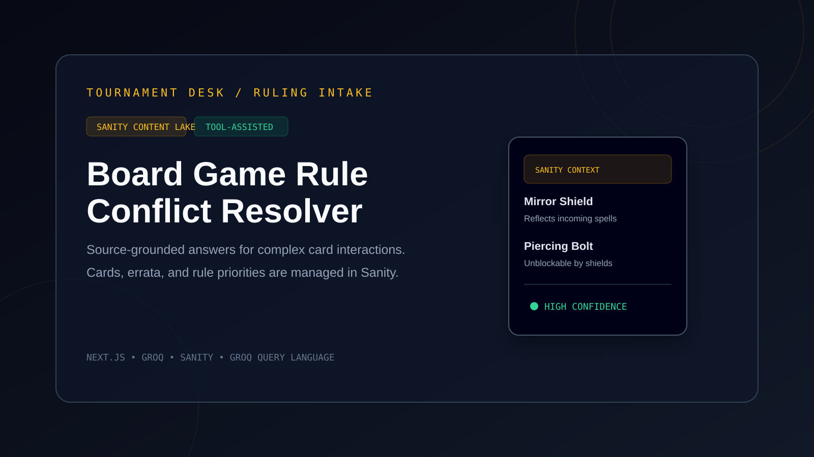
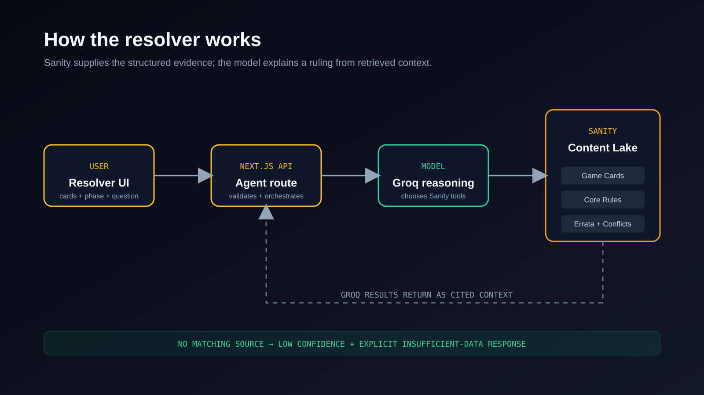
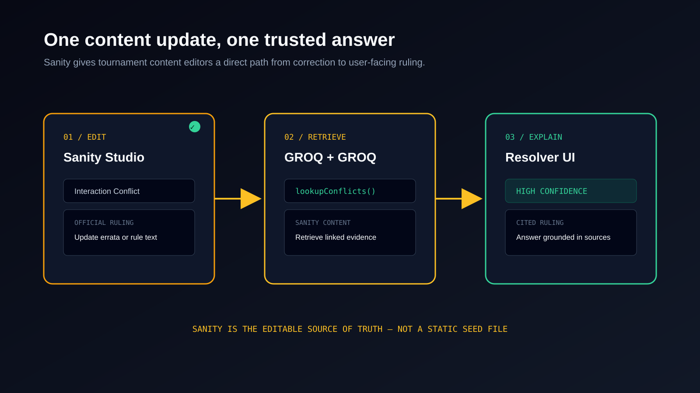
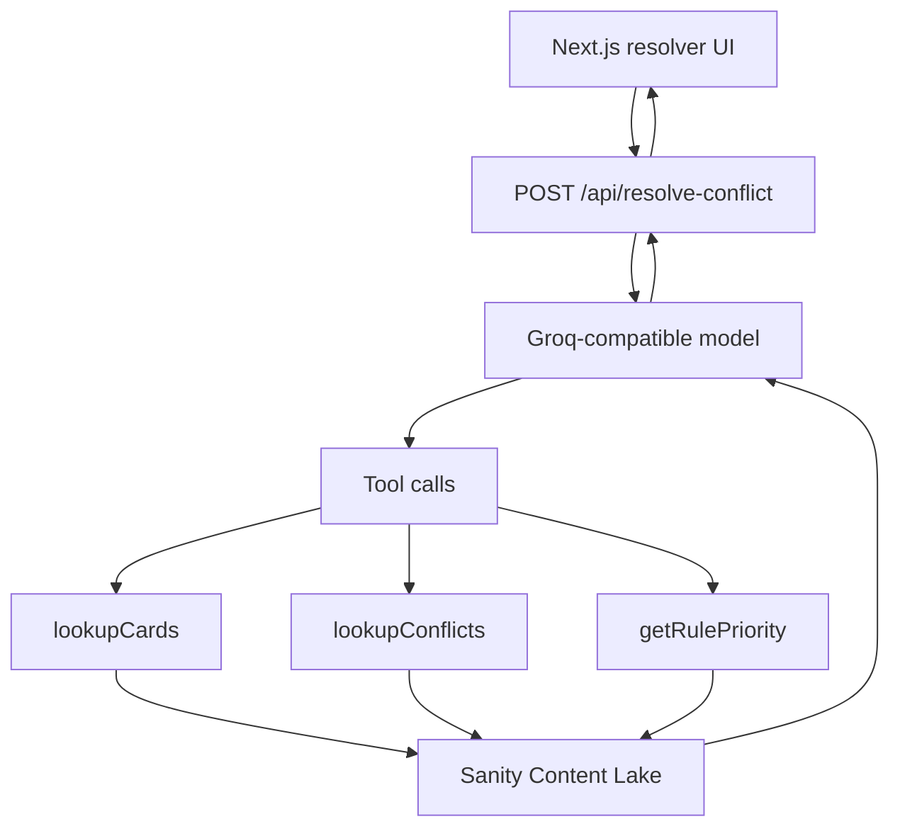

# Board Game Rule Conflict Resolver

A source-grounded board game tournament judge. The app uses Sanity as its structured source of truth for card text, errata, and rule priorities, then uses a Groq-compatible language model to decide which sources to query and produce a JSON ruling. The included cards and rulings are fictional demo content created to showcase the workflow.

## Submission Graphics

These original graphics summarize the product and its Sanity integration:







For a challenge submission, pair these graphics with screenshots of the resolver showing a completed ruling and Sanity Studio showing the linked `interactionConflict` document. The seeded cards and rulings are fictional demo content; replace them with licensed or officially maintained game data for production use.

### Recommended demo flow

1. Open Sanity Studio at `/studio` and edit the `Interaction Conflict / Errata` document for `Mirror Shield vs. Piercing Bolt`.
2. Update the official resolution or linked governing rule and publish the document.
3. Return to the resolver, submit the same card interaction, and show the answer grounded in the updated Sanity content.
4. Submit an unknown card such as `Mystic Dragon` to demonstrate the low-confidence, insufficient-data safeguard.

This flow demonstrates the key Sanity contribution: content editors can maintain structured rulings without changing application code, while the resolver retrieves that content through GROQ-backed tools.

## What It Does

- Looks up card mechanics with the `lookupCards` tool.
- Searches linked interaction conflicts and errata with `lookupConflicts`.
- Retrieves ordered core rules with `getRulePriority`.
- Accepts multiple cards, the current game phase, and a player question.
- Requires the model to rely only on retrieved Sanity context.
- Returns low confidence with an explicit insufficient-data message when Sanity has no definitive answer.

## Architecture



## Tech Stack

- Next.js 16 App Router and React 19
- TypeScript
- Tailwind CSS
- Sanity Studio and GROQ
- Groq SDK for model requests and tool calling

## Project Layout

```text
app/
	api/resolve-conflict/route.ts   Agent endpoint
	page.tsx                         Resolver UI
	studio/[[...tool]]/page.tsx      Embedded Sanity Studio
sanity/
	schemaTypes/                     Card, rule, and conflict schemas
	lib/agentTools.ts                GROQ-backed agent tools
	seed.json                        Example dataset
scripts/test-agent.ts              End-to-end test runner
```

## Prerequisites

- Node.js 20 or newer
- An accessible Sanity project and dataset
- A Groq API key

## Setup

Run these commands from the app directory:

```bash
cd /home/gulrez/boardgame-rule-agent/boardgame-rule-agent
npm install
```

Create `.env.local` in the app directory:

```env
NEXT_PUBLIC_SANITY_PROJECT_ID="your_sanity_project_id"
NEXT_PUBLIC_SANITY_DATASET="production"
GROQ_API_KEY="gsk_your_groq_api_key"
```

Optional settings:

```env
NEXT_PUBLIC_SANITY_API_VERSION="2026-09-28"
GROQ_MODEL="openai/gpt-oss-120b"
```

`GROQ_API_KEY` is used only by the server route. Do not expose it in client-side code or commit `.env.local`. If a key has ever been exposed, revoke it in the provider dashboard and create a replacement before running the app.

## Seed Sanity

Make sure the project ID and dataset in `.env.local` match the target Sanity project, then import the sample content:

```bash
npx sanity dataset import sanity/seed.json production --replace
```

The seed data contains example cards, core rules, and interaction conflicts used by the end-to-end tests. The `--replace` flag replaces the target dataset, so do not use it against a dataset containing content you need to keep.

## Run Locally

Start the development server:

```bash
npm run dev
```

Open:

- Resolver: <http://localhost:3000>
- Sanity Studio: <http://localhost:3000/studio>

## Test the Agent

The test runner sends requests to `http://localhost:3000/api/resolve-conflict`, so keep `npm run dev` running in a separate terminal. From the app directory, run:

```bash
npx tsx scripts/test-agent.ts

# Or, using the package script:
npm run test:e2e
```

The suite covers explicit errata, rule-priority fallback, a three-card interaction, and an unknown-card low-confidence fallback. A `FETCH FAILED` result usually means the development server is not running or is not listening on port 3000.

## Validation

Run the project TypeScript check:

```bash
npx tsc --noEmit
```

Run the production build:

```bash
npm run build
```

Run ESLint:

```bash
npm run lint
```

## API Contract

`POST /api/resolve-conflict` accepts:

```json
{
	"cards": ["Mirror Shield", "Piercing Bolt"],
	"currentPhase": "Action Phase",
	"question": "Can Mirror Shield reflect Piercing Bolt?"
}
```

Successful responses have this shape:

```json
{
	"success": true,
	"agentRuling": {
		"verdict": "Clear 1-sentence ruling.",
		"reasoning": "Step-by-step breakdown referencing retrieved card text or rules.",
		"citedDocuments": ["document-id-or-title"],
		"confidence": "high"
	}
}
```

The `confidence` value is `high`, `medium`, or `low`. The route returns HTTP 400 when `cards` is missing or empty, and HTTP 500 when the agent or Sanity request fails.

## Content Model

- `gameCard`: card identity, effect text, keywords, and trigger phase.
- `gameRule`: ordered core rule priorities and rule text.
- `interactionConflict`: linked cards, conflict description, official ruling, and resolution priority.

The agent tools query these document types directly from Sanity. Add or revise demo or licensed content in Sanity Studio rather than hard-coding rulings in the route.

## Important Limitation

This project is only as authoritative as the content in its Sanity dataset. When the Content Lake does not contain a definitive matching card, conflict, or rule, the agent must report insufficient official data instead of inventing a ruling.
